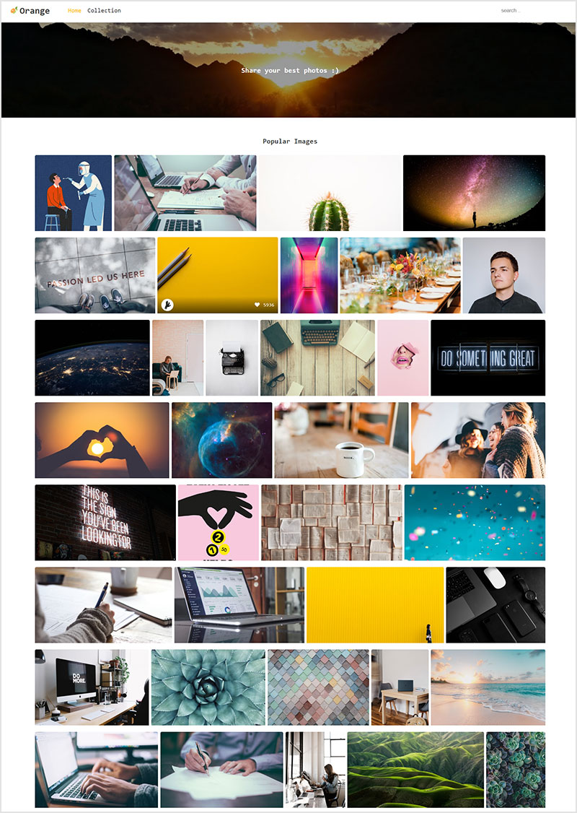
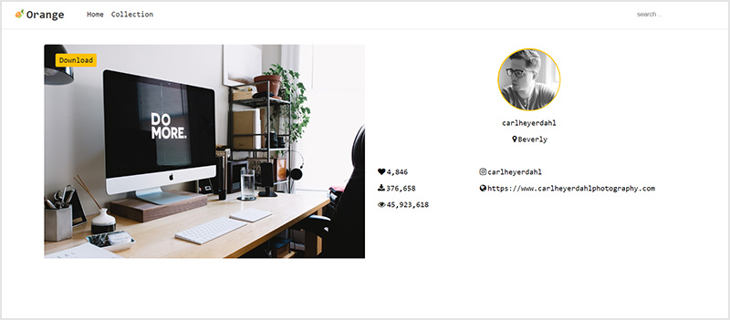
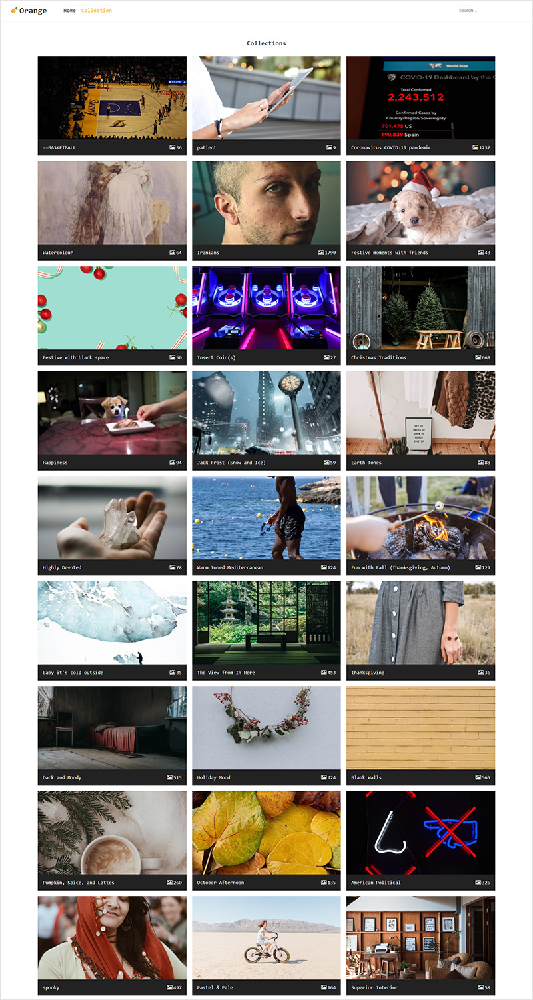
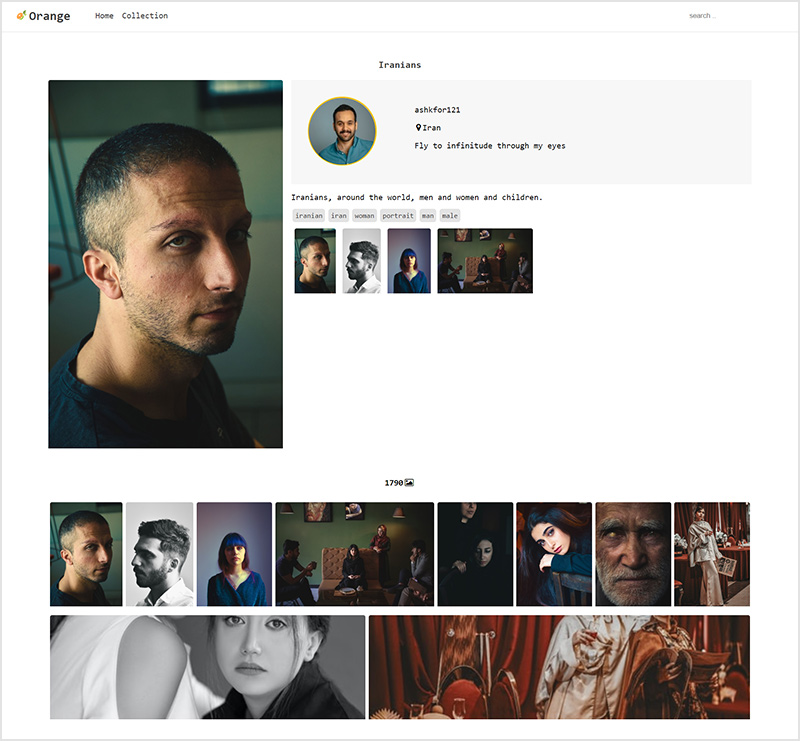

# Orange Gallery
An Angular6 web application using unsplash api

## Built With

- Angular CLI
- Angular 6.1
- [Unsplash api](https://unsplash.com/documentation)

## Prerequisites
- Node.js
- NPM

## Installing & Local Development

> npm install

> ng serve

Run `ng serve` for a dev server. Navigate to `http://localhost:4200/`. The app will automatically reload if you change any of the source files.

## Build

Run `ng build` to build the project. The build artifacts will be stored in the `dist/` directory.

Use the `ng build --prod --build-optimizer` for a production build.

## Contributors
[**Mina Hosseini Moghadam**](https://www.linkedin.com/in/minahmoghadam)

## Screenshots
- Home

- Photo

- Collections

- Collection

